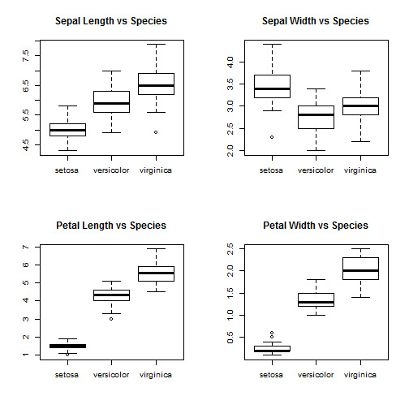
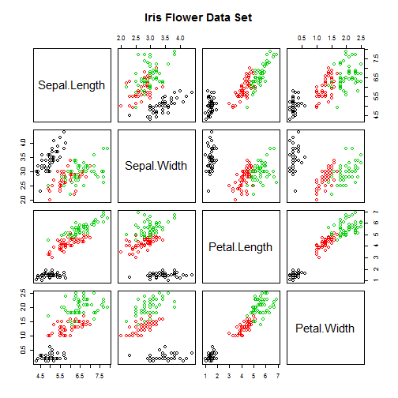

## About IRIS Flower Data Set

- A multivariate data set introduced by Sir Ronald Fisher (1936) as an example of discriminant analysis.
- The data set consists of 50 samples from each of three species of Iris:
        
        1. Iris setosa
        2. Iris virginica
        3. Iris versicolor
- Four features were measured (in cm) from each sample:

        - Sepal length and width
        - Petal length and width
- In this slidify deck we present exploratory data analysis with this data set.

---

## Loading IRIS Data and Summarizing.


```r
library(datasets) #Load dataset library
data(iris) #Load iris dataset
summary(iris)
```

```
##   Sepal.Length    Sepal.Width     Petal.Length    Petal.Width   
##  Min.   :4.300   Min.   :2.000   Min.   :1.000   Min.   :0.100  
##  1st Qu.:5.100   1st Qu.:2.800   1st Qu.:1.600   1st Qu.:0.300  
##  Median :5.800   Median :3.000   Median :4.350   Median :1.300  
##  Mean   :5.843   Mean   :3.057   Mean   :3.758   Mean   :1.199  
##  3rd Qu.:6.400   3rd Qu.:3.300   3rd Qu.:5.100   3rd Qu.:1.800  
##  Max.   :7.900   Max.   :4.400   Max.   :6.900   Max.   :2.500  
##        Species  
##  setosa    :50  
##  versicolor:50  
##  virginica :50  
##                 
##                 
## 
```

---

## Box Plot for Different Species

 

---

## Scatter Plot for different species

 


